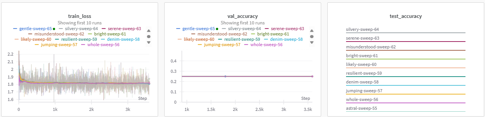
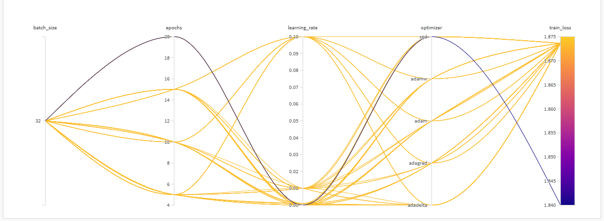
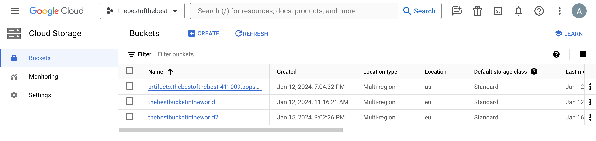
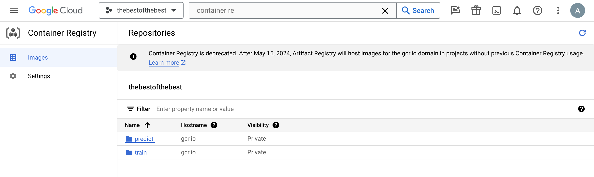
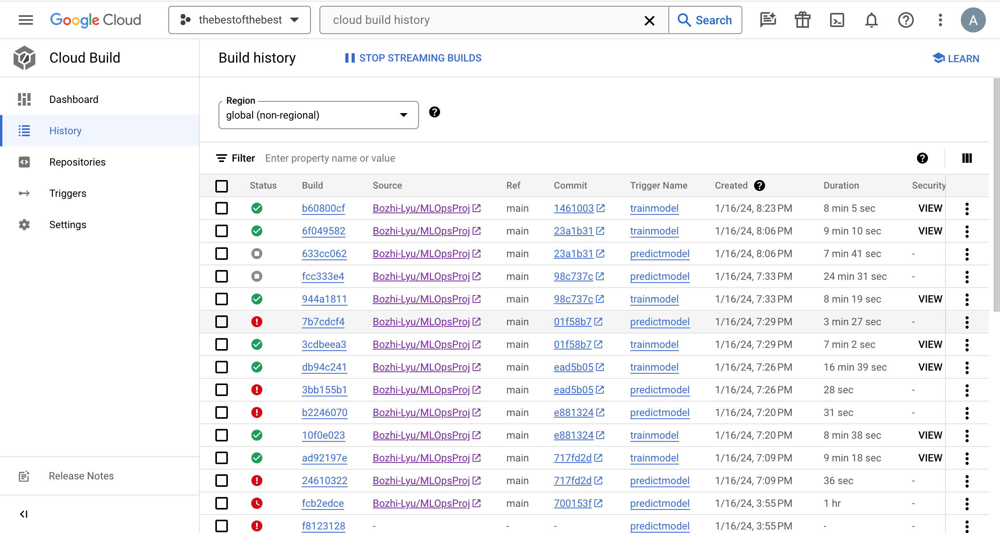
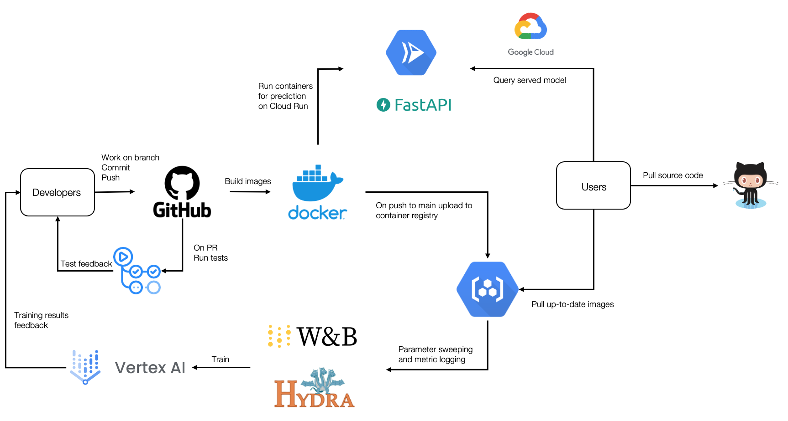

# Exam template for 02476 Machine Learning Operations

This is the report template for the exam. Please only remove the text formatted as with three dashes in front and behind
like:

```--- question 1 fill here ---```

where you instead should add your answers. Any other changes may have unwanted consequences when your report is auto
generated in the end of the course. For questions where you are asked to include images, start by adding the image to
the `figures` subfolder (please only use `.png`, `.jpg` or `.jpeg`) and then add the following code in your answer:

```markdown

```

In addition to this markdown file, we also provide the `report.py` script that provides two utility functions:

Running:

```bash
python report.py html
```

will generate an `.html` page of your report. After deadline for answering this template, we will autoscrape
everything in this `reports` folder and then use this utility to generate an `.html` page that will be your serve
as your final handin.

Running

```bash
python report.py check
```

will check your answers in this template against the constrains listed for each question e.g. is your answer too
short, too long, have you included an image when asked to.

For both functions to work it is important that you do not rename anything. The script have two dependencies that can
be installed with `pip install click markdown`.

## Overall project checklist

The checklist is *exhaustic* which means that it includes everything that you could possible do on the project in
relation the curricilum in this course. Therefore, we do not expect at all that you have checked of all boxes at the
end of the project.

### Week 1

* [X] Create a git repository
* [X] Make sure that all team members have write access to the github repository
* [X] Create a dedicated environment for you project to keep track of your packages
* [X] Create the initial file structure using cookiecutter
* [X] Fill out the `make_dataset.py` file such that it downloads whatever data you need and
* [X] Add a model file and a training script and get that running
* [X] Remember to fill out the `requirements.txt` file with whatever dependencies that you are using
* [X] Remember to comply with good coding practices (`pep8`) while doing the project
* [X] Do a bit of code typing and remember to document essential parts of your code
* [X] Setup version control for your data or part of your data
* [X] Construct one or multiple docker files for your code
* [X] Build the docker files locally and make sure they work as intended
* [X] Write one or multiple configurations files for your experiments
* [X] Used Hydra to load the configurations and manage your hyperparameters
* [ ] When you have something that works somewhat, remember at some point to to some profiling and see if
      you can optimize your code
* [X] Use Weights & Biases to log training progress and other important metrics/artifacts in your code. Additionally,
      consider running a hyperparameter optimization sweep.
* [ ] Use Pytorch-lightning (if applicable) to reduce the amount of boilerplate in your code

### Week 2

* [X] Write unit tests related to the data part of your code
* [X] Write unit tests related to model construction and or model training
* [X] Calculate the coverage.
* [X] Get some continuous integration running on the github repository
* [X] Create a data storage in GCP Bucket for you data and preferable link this with your data version control setup
* [X] Create a trigger workflow for automatically building your docker images
* [X] Get your model training in GCP using either the Engine or Vertex AI
* [X] Create a FastAPI application that can do inference using your model
* [ ] If applicable, consider deploying the model locally using torchserve
* [X] Deploy your model in GCP using either Functions or Run as the backend

### Week 3

* [ ] Check how robust your model is towards data drifting
* [X] Setup monitoring for the system telemetry of your deployed model
* [X] Setup monitoring for the performance of your deployed model
* [ ] If applicable, play around with distributed data loading
* [ ] If applicable, play around with distributed model training
* [ ] Play around with quantization, compilation and pruning for you trained models to increase inference speed

### Additional

* [X] Revisit your initial project description. Did the project turn out as you wanted?
* [X] Make sure all group members have a understanding about all parts of the project
* [X] Uploaded all your code to github

## Group information

### Question 1
> **Enter the group number you signed up on <learn.inside.dtu.dk>**
>
> Answer:

20

### Question 2
> **Enter the study number for each member in the group**
>
> Example:
>
> *sXXXXXX, sXXXXXX, sXXXXXX*
>
> Answer:

s183478, s232251, s194274, s230212

### Question 3
> **What framework did you choose to work with and did it help you complete the project?**
>
> Answer length: 100-200 words.
>
> Example:
> *We used the third-party framework ... in our project. We used functionality ... and functionality ... from the*
> *package to do ... and ... in our project*.
>
> Answer:

We used the third-party framework Huggingface in our project, with which we used the functionality of importing specific models. This involved using the *transformers* package, which allowed us to use the exact model we wanted, namely the DeIT (Data-efficient Image Transformer) model. This enabled us to use our chosen model without having to implement the model ourselves. The specific functionalities we use are the `DeiTClassifier` and the `DeiTConfig` classes.

## Coding environment

> In the following section we are interested in learning more about you local development environment.

### Question 4

> **Explain how you managed dependencies in your project? Explain the process a new team member would have to go**
> **through to get an exact copy of your environment.**
>
> Answer length: 100-200 words
>
> Example:
> *We used ... for managing our dependencies. The list of dependencies was auto-generated using ... . To get a*
> *complete copy of our development environment, one would have to run the following commands*
>
> Answer:

We used `pip` for managing our dependencies. The list of dependencies can be generated using the command `pip list --format=freeze > requirements.txt`, which will generate a file containing all the packages used in this project. However, since this command lists every single package used with no regard to readability or the important packages that we actually use, we have provided a `requirements.txt` file that contains a clean version of this list.

In order to get a complete copy of our development environment, one can run the following command:
```pip install -r requirements.txt```

### Question 5

> **We expect that you initialized your project using the cookiecutter template. Explain the overall structure of your**
> **code. Did you fill out every folder or only a subset?**
>
> Answer length: 100-200 words
>
> Example:
> *From the cookiecutter template we have filled out the ... , ... and ... folder. We have removed the ... folder*
> *because we did not use any ... in our project. We have added an ... folder that contains ... for running our*
> *experiments.*
> Answer:

From the cookiecutter template we have filled out the data, dockerfiles, src, tests and notebooks folders. We have removed the src/visualizations folder since we do not produce any visualizations through code, but rather through Weights & Biases. We have added a .dvc folder that is used for storing configs and temporary files for our data version control program, DVC.

### Question 6

> **Did you implement any rules for code quality and format? Additionally, explain with your own words why these**
> **concepts matters in larger projects.**
>
> Answer length: 50-100 words.
>
> Answer:

For this project we have used the PEP8 standard across our files. The reason for why it is important for larger projects is that the code should be easily readable for people who have not been involved in coding certain files. It may not be intuitive what type each variable is when you look at a project for the first time, and enforcing code quality and formats helps in this regard

## Version control

> In the following section we are interested in how version control was used in your project during development to
> corporate and increase the quality of your code.

### Question 7

> **How many tests did you implement and what are they testing in your code?**
>
> Answer length: 50-100 words.
>
> Example:
> *In total we have implemented X tests. Primarily we are testing ... and ... as these the most critical parts of our*
> *application but also ... .*
>
> Answer:

Test input and output of shape. 

### Question 8

> **What is the total code coverage (in percentage) of your code? If you code had an code coverage of 100% (or close**
> **to), would you still trust it to be error free? Explain you reasoning.**
>
> Answer length: 100-200 words.
>
> Example:
> *The total code coverage of code is X%, which includes all our source code. We are far from 100% coverage of our **
> *code and even if we were then...*
>
> Answer:

Approx. 70%

### Question 9

> **Did you workflow include using branches and pull requests? If yes, explain how. If not, explain how branches and**
> **pull request can help improve version control.**
>
> Answer length: 100-200 words.
>
> Example:
> *We made use of both branches and PRs in our project. In our group, each member had an branch that they worked on in*
> *addition to the main branch. To merge code we ...*
>
> Answer:

We made use of both branches and PRs in our project. In our group, we submitted each point in the project checklist as issues on Github, which allowed us to assign ourselves to each issue and solve them. We then made branches for each issue, and when the issue was resolved we created pull requests for merging into the main branch. 

### Question 10

> **Did you use DVC for managing data in your project? If yes, then how did it improve your project to have version**
> **control of your data. If no, explain a case where it would be beneficial to have version control of your data.**
>
> Answer length: 100-200 words.
>
> Example:
> *We did make use of DVC in the following way: ... . In the end it helped us in ... for controlling ... part of our*
> *pipeline*
>
> Answer:

For our project we used DVC to manage our data, and it helped us by allowing us to save our data and models remotely. These could then also be used on the Cloud functions and in our containers which was of great benefit. Although we didn't update the data throughout the project, it would have been beneficial to track the changes to the data using DVC.

### Question 11

> **Discuss you continues integration setup. What kind of CI are you running (unittesting, linting, etc.)? Do you test**
> **multiple operating systems, python version etc. Do you make use of caching? Feel free to insert a link to one of**
> **your github actions workflow.**
>
> Answer length: 200-300 words.
>
> Example:
> *We have organized our CI into 3 separate files: one for doing ..., one for running ... testing and one for running*
> *... . In particular for our ..., we used ... .An example of a triggered workflow can be seen here: <weblink>*
>
> Answer:

--- question 11 fill here ---

## Running code and tracking experiments

> In the following section we are interested in learning more about the experimental setup for running your code and
> especially the reproducibility of your experiments.

### Question 12

> **How did you configure experiments? Did you make use of config files? Explain with coding examples of how you would**
> **run a experiment.**
>
> Answer length: 50-100 words.
>
> Example:
> *We used a simple argparser, that worked in the following way: python my_script.py --lr 1e-3 --batch_size 25*
>
> Answer:

In our project we used config files, and to load those we used both `OmegaConf` and `Hydra`. `OmegaConf` was used to load the model parameters, since it returns the loaded parameters as a dict, which is beneficial for loading model parameters, and `Hydra` was used with the model training, as it can provides wrappers for use with functions.

### Question 13

> **Reproducibility of experiments are important. Related to the last question, how did you secure that no information**
> **is lost when running experiments and that your experiments are reproducible?**
>
> Answer length: 100-200 words.
>
> Example:
> *We made use of config files. Whenever an experiment is run the following happens: ... . To reproduce an experiment*
> *one would have to do ...*
>
> Answer:

In order to ensure reproducibility of experiments we used config files as mentioned in the previous question. This, in combination with the use of Git, allowed us to easily keep track of which parameters were used whenever we started training. In addition to this, we also keep track of the seed used for `torch`, which also ensures that we get the exact conditions that lead to our results.

### Question 14

> **Upload 1 to 3 screenshots that show the experiments that you have done in W&B (or another experiment tracking**
> **service of your choice). This may include loss graphs, logged images, hyperparameter sweeps etc. You can take**
> **inspiration from [this figure](figures/wandb.png). Explain what metrics you are tracking and why they are**
> **important.**
>
> Answer length: 200-300 words + 1 to 3 screenshots.
>
> Example:
> *As seen in the first image when have tracked ... and ... which both inform us about ... in our experiments.*
> *As seen in the second image we are also tracking ... and ...*
>
> Answer:

--- question 14 fill here ---

As seen in the first image, we have tracked training loss, validation accuracy and test accuracy. The model was shown to train well, however the model was not able to predict well as shown in both the validation and test accuracy charts. The models inability to predict well could be due to the size of model being too small, as well as the data being affected by a majority class. This leads to the model predicting only one class and reducing the effectiveness of the model.


In this second image we try to explore optimal hyperparameters using the Sweep functionality from Weights & Biases, which allows us to randomly select certain hyperparameters and create runs based on those. As shown in the image, we try randomising the epoch count, the learning rate, and the optimizers. We initialily also varied the batch size, but we saw that it didn't affect the training, and so we kept that fixed. We can see that most of the configurations converge with a training loss around 1.875, but one configuration managed to achieve a lower loss, namely one using SGD optimizer, 20 epochs, and a low learning rate.

### Question 15

> **Docker is an important tool for creating containerized applications. Explain how you used docker in your**
> **experiments? Include how you would run your docker images and include a link to one of your docker files.**
>
> Answer length: 100-200 words.
>
> Example:
> *For our project we developed several images: one for training, inference and deployment. For example to run the*
>
> Answer:

We created two dockerfiles: one for the training and one for the prediction. We used standard Docker commands for to build and run these containers, like `docker build` and `docker run`, which facilitated a modular and efficient development process. This setup provided a streamlined, efficient pipeline, as it seperated the resource-intensive training phase from the leaner prediction phase.

### Question 16

> **When running into bugs while trying to run your experiments, how did you perform debugging? Additionally, did you**
> **try to profile your code or do you think it is already perfect?**
>
> Answer length: 100-200 words.
>
> Example:
> *Debugging method was dependent on group member. Some just used ... and others used ... . We did a single profiling*
> *run of our main code at some point that showed ...*
>
> Answer:

When we encountered issues we needed to fix we had a collaborative approach, especially if an issue couldn't be resolved individually. Our individual approaches varied - some used traditional methods for instance insert print statements to track variable values, whiles others relied more on the solutions provided by the IDE. The traditional approach is easy and can many times help narrow down where the problem happens but not the best way to do it when we have a lot of code and dependencies - we kept this in mind and only used the traditional method for small stuff.

## Working in the cloud

> In the following section we would like to know more about your experience when developing in the cloud.

### Question 17

> **List all the GCP services that you made use of in your project and shortly explain what each service does?**
>
> Answer length: 50-200 words.
>
> Example:
> *We used the following two services: Engine and Bucket. Engine is used for... and Bucket is used for...*
>
> Answer:

We used the following services: Bucket, Vertex AI, Container Registry, Cloud Run. Bucket is used for DVC data versioning, Container registry for storing and building train and predict images, Vertex AI for running train containers (and doing parameter search), and Cloud run for running FastAPI prediction and serving the model online. We use monitoring and alert systems for the Cloud Run to track the model in production over different metrics and amount of responses.


### Question 18

> **The backbone of GCP is the Compute engine. Explained how you made use of this service and what type of VMs**
> **you used?**
>
> Answer length: 100-200 words.
>
> Example:
> *We used the compute engine to run our ... . We used instances with the following hardware: ... and we started the*
> *using a custom container: ...*
>
> Answer:

We used Compute engine for running early instances of training and predict containers.
We used e2-medium VM with CPU architecture. The size of the disc was 10GB. It was perfect for our reasonably sized data and models and although it generated the most cost the size of the VM made us save a lot of money.
It was useful for debugging and getting familiar with the structure of Google Cloud but did not end up in the final pipeline. We omitted the compute engine in favor of vertex ai and cloud run for serving models. 

### Question 19

> **Insert 1-2 images of your GCP bucket, such that we can see what data you have stored in it.**
> **You can take inspiration from [this figure](figures/bucket.png).**
>
> Answer:



### Question 20

> **Upload one image of your GCP container registry, such that we can see the different images that you have stored.**
> **You can take inspiration from [this figure](figures/registry.png).**
>
> Answer:



### Question 21

> **Upload one image of your GCP cloud build history, so we can see the history of the images that have been build in**
> **your project. You can take inspiration from [this figure](figures/build.png).**
>
> Answer:



### Question 22

> **Did you manage to deploy your model, either in locally or cloud? If not, describe why. If yes, describe how and**
> **preferably how you invoke your deployed service?**
>
> Answer length: 100-200 words.
>
> Example:
> *For deployment we wrapped our model into application using ... . We first tried locally serving the model, which*
> *worked. Afterwards we deployed it in the cloud, using ... . To invoke the service an user would call*
> *`curl -X POST -F "file=@file.json"<weburl>`*
>
> Answer:

We successfully deployed our model in the cloud using FastAPI and Cloud Run, but we didn not implement a local deployment beforehand. While the construction of a local deployments could have proved beneficial in order to see the deployment's functionality and performance, we chose to prioritize deploying directly to the cloud. This decision was based on our focus on cloud deployment as the primary aim. In order to use the deployed model, one could either visit the website in which it is hosted (https://predict-nzzyxeyodq-ew.a.run.app/docs), or call the following curl command:

```
curl -X 'POST' \
  'https://predict-nzzyxeyodq-ew.a.run.app/predict_image/' \
  -H 'accept: application/json' \
  -H 'Content-Type: multipart/form-data' \
  -F 'file=@test.png;type=image/png'
```

### Question 23

> **Did you manage to implement monitoring of your deployed model? If yes, explain how it works. If not, explain how**
> **monitoring would help the longevity of your application.**
>
> Answer length: 100-200 words.
>
> Example:
> *We did not manage to implement monitoring. We would like to have monitoring implemented such that over time we could*
> *measure ... and ... that would inform us about this ... behaviour of our application.*
>
> Answer:

We managed to implement monitoring for our deployed model in GCP. Monitoring plays a crucial role in maintaining the longevity and effectiveness of any application, especially those that involve complex models. First and foremost, we are able to track key performance metrics, error rates and performance over time. Additionally, it  enables us to detect any drift in the model's performance due to underlying data or user behavior, which is particularly important to ensure that the model remains relevant and accurate over time. Such problems are unique to ML applications and needs to be handled separately. A fun example related to this topic is ChatGPT where users have reported a noticeable drop in its response quality.

### Question 24

> **How many credits did you end up using during the project and what service was most expensive?**
>
> Answer length: 25-100 words.
>
> Example:
> *Group member 1 used ..., Group member 2 used ..., in total ... credits was spend during development. The service*
> *costing the most was ... due to ...*
>
> Answer:

Anne Sophie used 4.19 credits, Bozhi used 0 credits, Tobias used 4.09 credits and Jakub used 7.12 credits. Thus, in total 15.40 credits was spend during development. The most expensive service was Cloud Storage, secondly Vertex AI and thirdly Compute Engine. 

## Overall discussion of project

> In the following section we would like you to think about the general structure of your project.

### Question 25

> **Include a figure that describes the overall architecture of your system and what services that you make use of.**
> **You can take inspiration from [this figure](figures/overview.png). Additionally in your own words, explain the**
> **overall steps in figure.**
>
> Answer length: 200-400 words
>
> Example:
>
> *The starting point of the diagram is our local setup, where we integrated ... and ... and ... into our code.*
> *Whenever we commit code and puch to github, it auto triggers ... and ... . From there the diagram shows ...*
>
> Answer:



The diagram depicts a continuous integration and deployment pipeline for our machine learning system. Developers commit code to GitHub, which triggers automated tests. Merged changes lead to Docker container image builds, which are then stored in a registry. Our model is trained using Vertex AI, with configuration managed by Hydra and experiment tracking by W&B. The trained model is served through FastAPI, running on Google Cloud's Cloud Run. Users can pull the latest code from GitHub and retrieve updated Docker images to run the application locally. This setup facilitates efficient development, testing, training, and deployment of ML models, ensuring a streamlined process from code changes to model serving.

### Question 26

> **Discuss the overall struggles of the project. Where did you spend most time and what did you do to overcome these**
> **challenges?**
>
> Answer length: 200-400 words.
>
> Example:
> *The biggest challenges in the project was using ... tool to do ... . The reason for this was ...*
>
> Answer:

The main issues was to work out how to use the different tools, especially the Cloud based ones. In this course we have to learn and apply a lot of new tools, but on basic level and in relation to this deliverable. The complexity definitly increased as we needed to comprehend not only the individual tools, but also their interdependencies and collective functionality within our scope. This situation undoubtedly led to a series of notable hurdles, which in turn consumed a considerable amount of our time. This was particularly critical in terms of time management, a crucial aspect in the context of a condensed three-week course where every moment is valuable. Another issue that appeard multiple times was the inconsistent performance of tools across our various computers. This led to some work discrepancies, as the tool functioned well on some systems but not on others. To address this, we relied heavily on teamwork, where we shared solutions and tried to troubleshoot collectively. We also asked for assistance from the TAs. The varying performance of our tools across different computers also consumed a considerable amount of time which we could have used elsewhere. However, this is to be expected based on our individual experience, as this has been an issues that has arrised in other courses as well.

### Question 27

> **State the individual contributions of each team member. This is required information from DTU, because we need to**
> **make sure all members contributed actively to the project**
>
> Answer length: 50-200 words.
>
> Example:
> *Student sXXXXXX was in charge of developing of setting up the initial cookie cutter project and developing of the*
> *docker containers for training our applications.*
> *Student sXXXXXX was in charge of training our models in the cloud and deploying them afterwards.*
> *All members contributed to code by...*
>
> Answer:

--- question 27 fill here ---
s183478 was in charge of setting up the initial cookiecutter project, local building of docker files, continuous integration on Github, and Weights & Biases sweeping experimetation.

s232251

s194274

s230212 was in charge of POC model and configuration files, DVC, creating triggers, orchestrating training on vertex ai and serving model on cloud run, setting up telemetry and monitoring performance. 